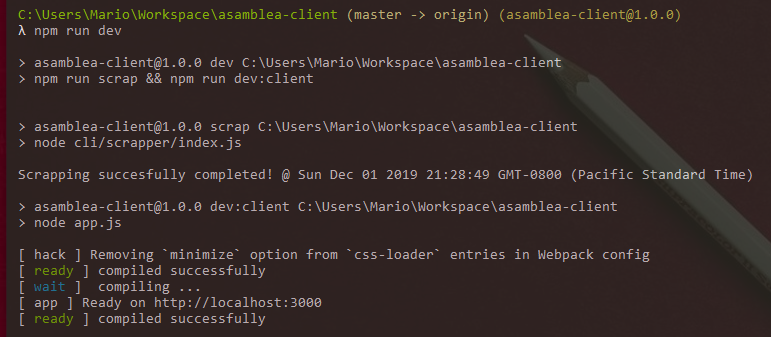
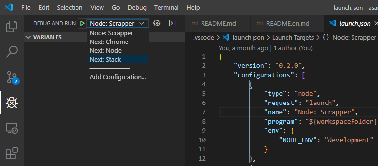

# Asamblea Tracker

> Puedes acceder a la versión temprana de la plataforma haciendo click en este [enlace](http://35.185.253.48/).

## Pre-requisitos

-   Node v10.16+
-   NPM v6.9.0+
-   MongoDB Server, consíguelo [aquí](https://fastdl.mongodb.org/win32/mongodb-win32-x86_64-2012plus-4.2.2-signed.msi) (Recomiendo abrir una cuenta en [mlab.com](mlab.com), para facilitar las cosas)

> Es requerido crear una base de datos, más no las colecciones. De eso se encargará el sistema.

## Instalación

    $ git clone https://github.com/mariomenjr/asamblea-tracker.git
    $ cd asamblea-tracker
    $ npm install

## Desarrollo

Una vez tengas creada la base de datos (otra vez, no es necesario que crees ninguna collección. El sistema se encargará de ello automáticamente), debes crear un archivo .env, en el root del proyecto, con las siguientes variables:

    // .env
    MONGO_USER=nombre_de_usuario_a_db
    MONGO_PASS=password_de_usuario_a_db
    MONGO_DB=nombre_de_db
    MONGO_HOST=host_name_o_dirección_ip
    MONGO_PORT=puerto_de_mongo

Ya que tienes la base de datos lista, puedes simplemente ejecutar:

    $ npm run dev

### Depuración

Por otro lado, si usás Visual Studio Code, puedes tomar ventaja de las opciones de depuración pre-configurada.

Si lo tuyo es el `console.log` a diestra y siniestra, tranquil@, I won't judge you.

## Contribuir

Si eres desarrollador y quieres aportar al proyecto, antes que nada, muchas gracias, cualquier aporte es bienvenido.

Lee [CONTRIBUTING.md](./.github/es/CONTRIBUTING.md)

## Enlaces

-   👀 [Platform Preview](http://35.185.253.48/)
-   😊 [Tweet hi!](https://twitter.com/mariomenjr)
-   🌎 [Asamblea Legislativa: Diputado/as](https://www.asamblea.gob.sv/diputados)

## Licencia

El código de este proyecto está bajo [licencia MIT](./LICENSE).
